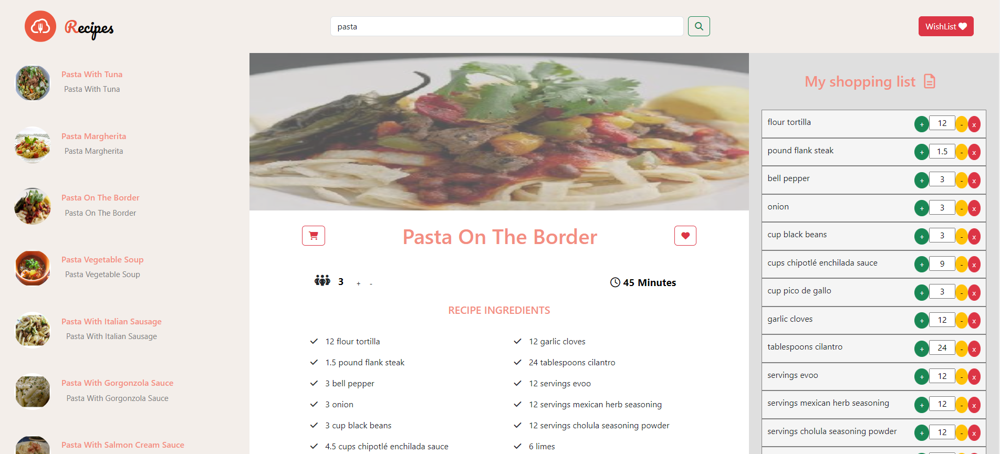

<br/>
<p align="center">
  <h1 align="center" style="color: #3498db; font-size: 2.5em;">Welcome👋 to my Recipes Project</h1>
</p>

## Overview

The Recipes Project is a recipe website where users can explore, save to a wishlist, manage shopping lists, and access cooking instructions. Key features include recipe search, wishlist, shopping list with quantity adjustment, cooking directions, and flavor information.

<p align="center">
  
</p>

## Installation

```bash
git clone https://github.com/MeirMeshulami/Recipes-Project.git
cd Recipes-Project
npm install
npm start
